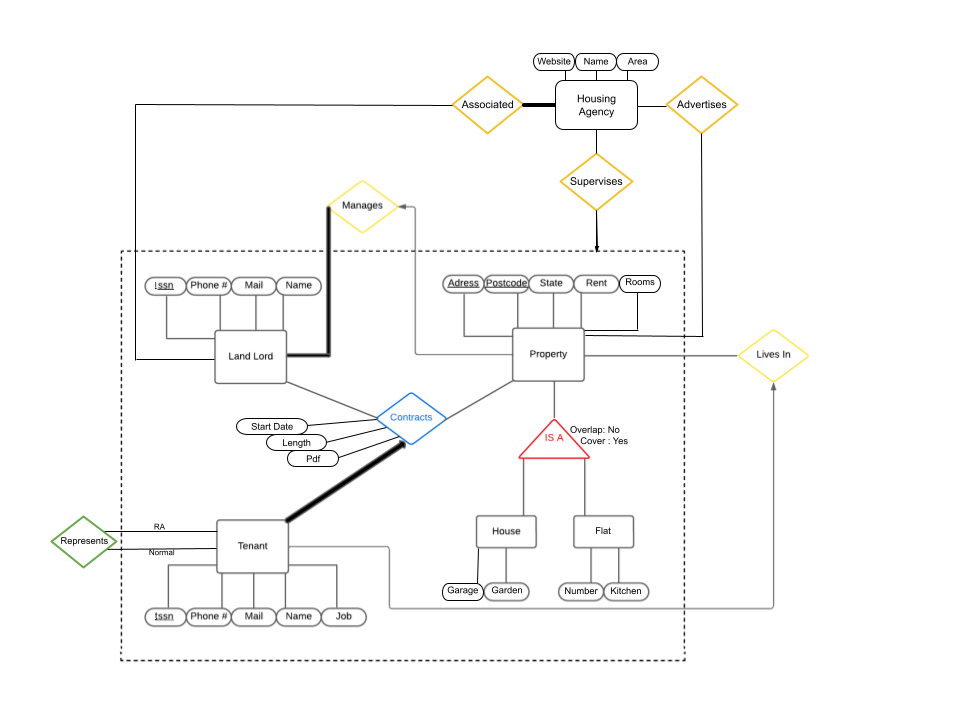

# Datarious

### Database course project by

- Diego Cañas
- Koorosh Komeilizadeh
- Mateusz Wilk

### Update Database:
```bash
sqlite3 assignment_database_update.db < assignment_ddl.sql
```

## ER Diagram
Last Update 17 March



## TODO
add attributes to property:
- area
- construction year
- Diego updates the ER Diagram
- add advertises and associated

## Project requirements
- landlords have: ssn, phone, mail, name
- tenants have: ssn, phone, mail, name, job
- properties have: adress, postcode, status (furnished/unfurnished), rent, rooms
- housing agencies have: website, name, area of operation
- flats are properties that also have a floor number and and can have a kitchen
- houses are properties that can have a garage and a garden
- tenants can only rent one property
- landlords can be registered in a housing agency
- flats/houses can have multiple tenants
- every landlord must have at least one property
- properties can have 0 or more tenants
- a housing contract is a relation between a landlord, tenants and optionally a housing agency
- tenants can also be resident assistants and residents, a resident assistant manages a group of residents