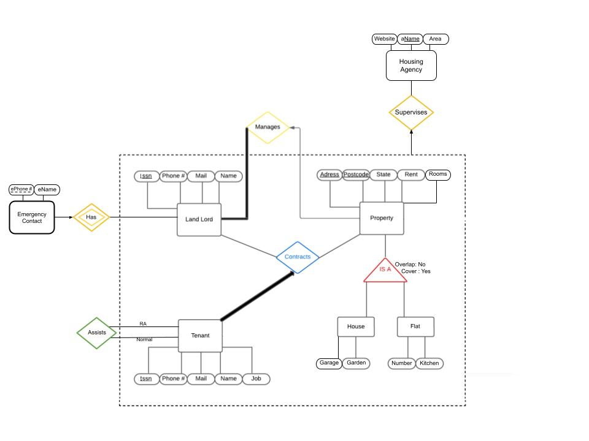

# Datarious (Prototype)

The Datarious Project is focused on designing a database using data scraped from the ["Pararius"](https://www.pararius.com/english) website to analyze housing challenges throughout the Netherlands.

**Update**: The prototype has been implemented with basic designs in place for future development using synthetic data.

#### Contributors

- Diego Cañas
- Koorosh Komeilizadeh
- Mateusz Wilk

### Update Database Command:
```bash
sqlite3 datarius_database_update.db < datarius_ddl.sql
```

## ER Diagram
Last Update 20 March




## Project requirements
- Landlords have: SSN, phone number, email, and name.
- Tenants have: SSN, phone number, email, name, and job.
- Properties have: address, postcode, status (furnished/unfurnished), rent, and number of rooms.
- Housing agencies have: website, name, and area of operation.
- Flats are properties that have a floor number and may include a kitchen.
- Houses are properties that may include a garage and a garden.
- Tenants can only rent one property.
- Landlords can be registered with a housing agency.
- Flats/houses can house multiple tenants.
- Every landlord must own at least one property.
- Properties can house zero or more tenants.
- A housing contract is a relationship between a landlord, tenants, and optionally a housing agency.
- Tenants can also serve as resident assistants; a resident assistant manages a group of residents.

## Bonus

(Bonus, 2p) Include an aggregation or ternary relation. (Already added)

(Bonus, 2p) Translate an aggregation or ternary relation. Identify which constraints could not be captured and explain why.

## Queries

### Queries Requirements:
Include one example of each of the following:
i. GROUP BY ... HAVING
ii. Set operation (UNION, INTERSECT, EXCEPT)
iii. Nested query or correlation
iv. Aggregation (MAX, AVG, SUM, COUNT)
v. Query over multiple tables (JOIN)
vi. LIKE (string matching)

Each query must be specified distinctly for each category to qualify for scoring. Please provide a brief explanation of what each query computes; without an explanation, no points will be awarded.
(Bonus#1, 3p) Challenging query
(Bonus#2, 3p) Challenging query

